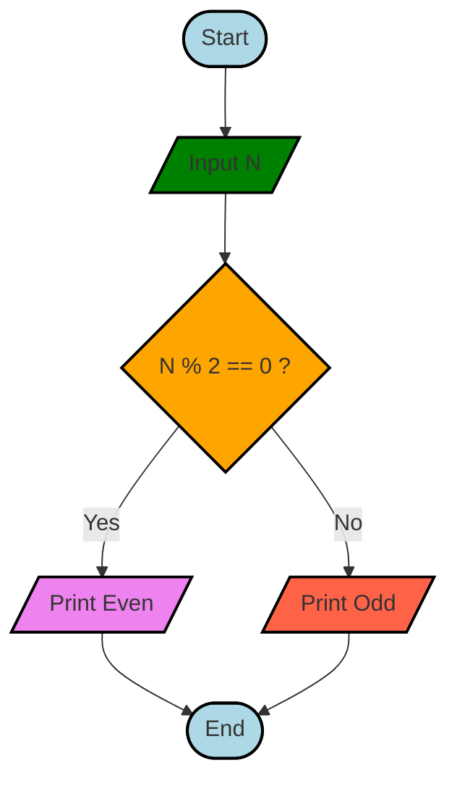
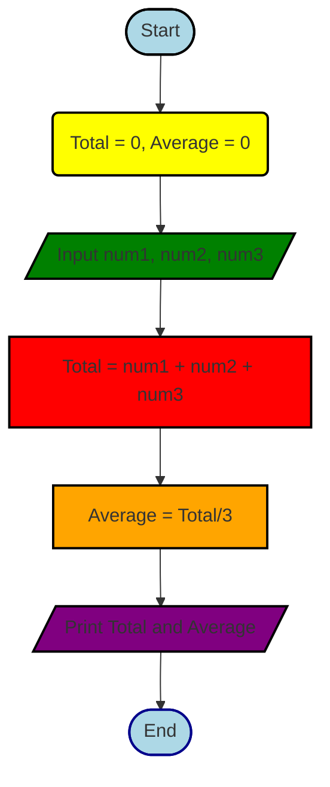
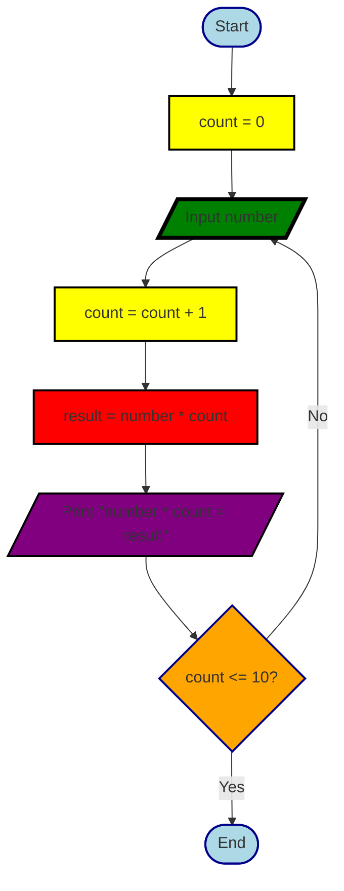
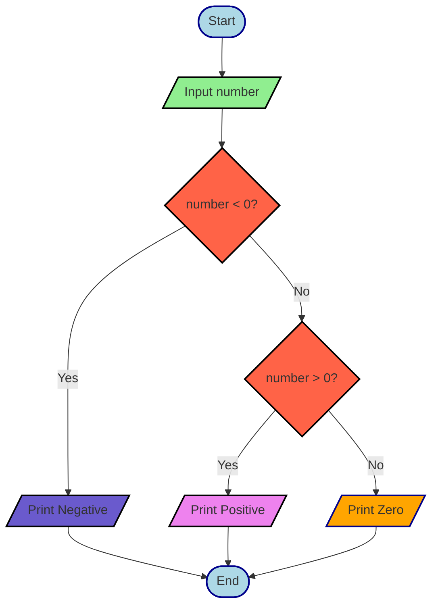
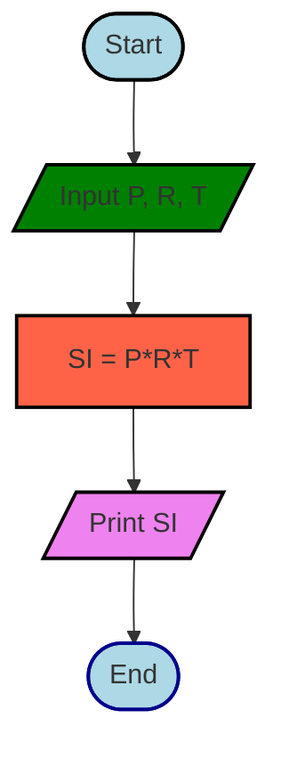
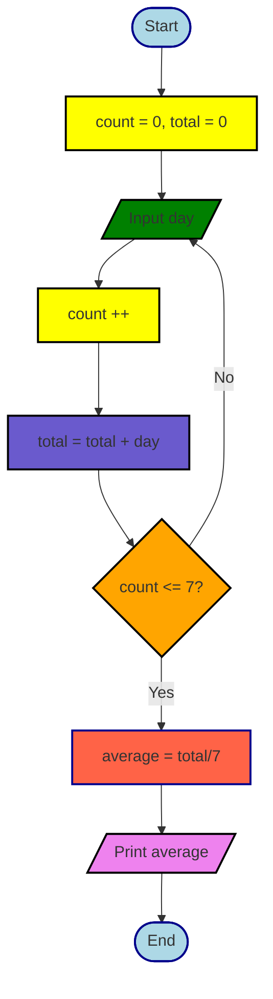
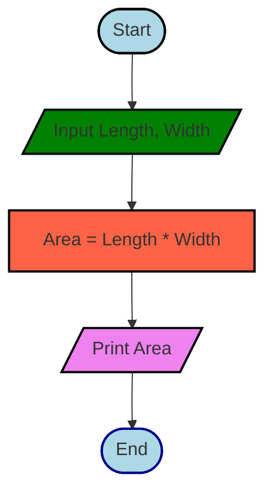
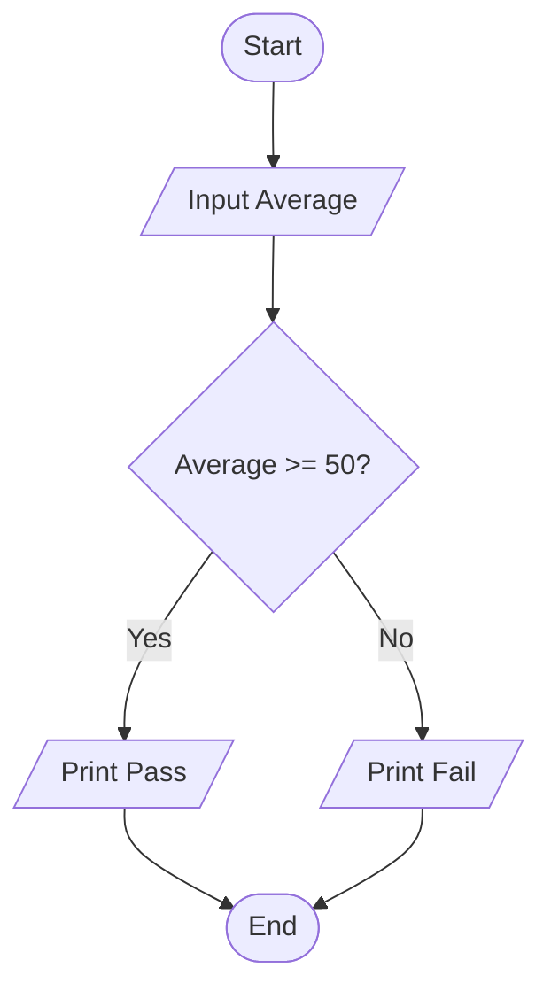
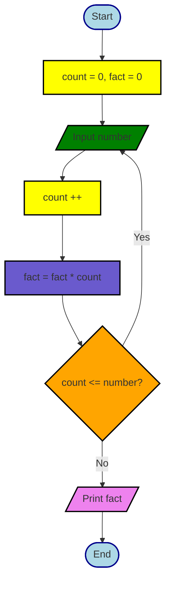
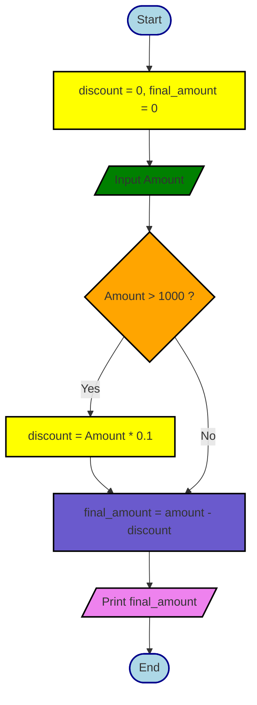

## Flowchart Exercise 1

--- 

## Flowchart Exercise 2

---

## Flowchart Exercise 3

---
## Flowchart Exercise 4

---

## Flowchart Exercise 5

---

## Flowchart Exercise 6

---

## Flowchart Exercise 7

---

## Flowchart Exercise 8

---

## Flowchart Exercise 9

---

## Flowchart Exercise 10

---